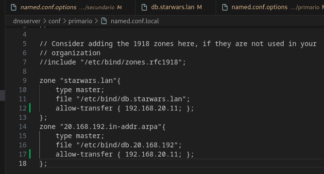
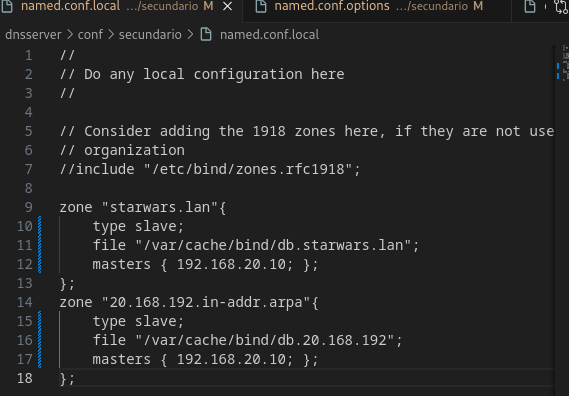
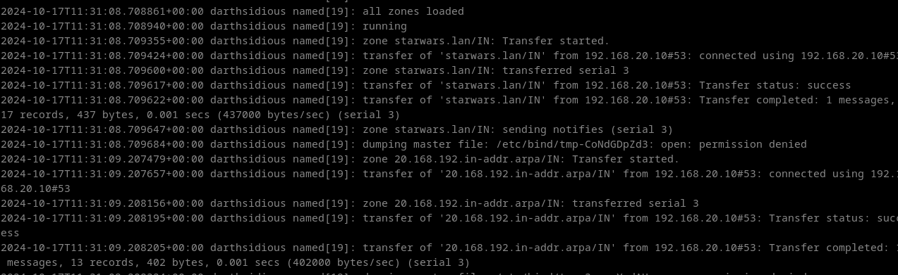
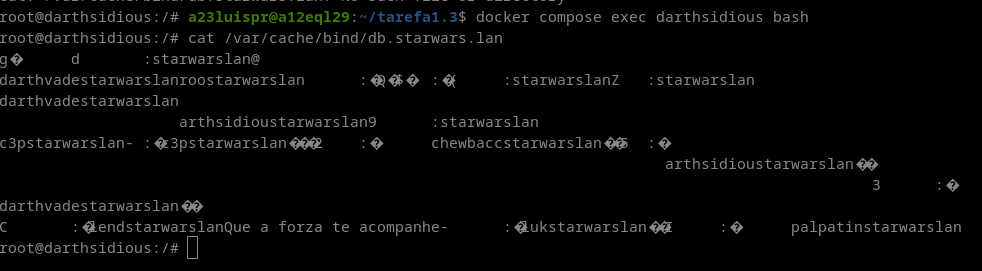
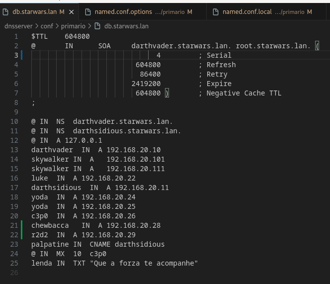
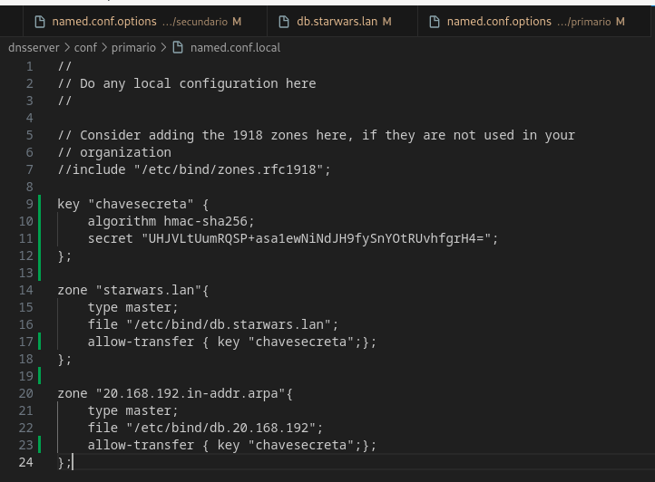
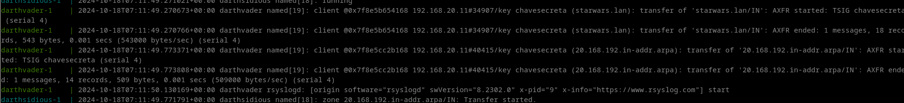

# Tarefa 1.3 Instalación de zonas secundarias.

Partindo da tarefa 1.1, engadiremos un servidor DNS secundario con BIND9 nunha máquina Debian

1. Tomaremos a máquina darthsidious, e configuraremola para ser servidor secundario, tanto da zona primaria de resolución directa como de resolución inversa. Captura os ficheiros de configuración en ambalas dúas máquinas. Fai unha captura onde se vexa o reinicio da máquina darthsidious, no que se vexa no log dos dous equipos e que se fixo a transferencia de zona.

2. Engade un rexistro tipo A (Chewbacca 192.168.0.28) na zona de resolución directa e tamén na de resolución inversa.  Fai unha captura no momento do reinicio do equipo darthvader, no que se vexa o log dos dous equipos e que se amose que se fixo a transferencia de zona. Adxunta tamén unha captura do ficheiro de zona no servidor secundario.

3. Comproba que o servidor secundario pode resolver ese nome.

4. Fai os cambios necesarios para que as trasferencias se fagan de forma segura empregando chaves.  Repite as capturas e vídeos do punto 2, engadindo o rexistro r2d2 (192.168.0.29)

